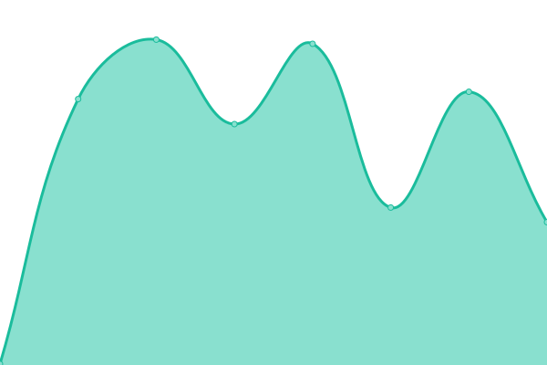
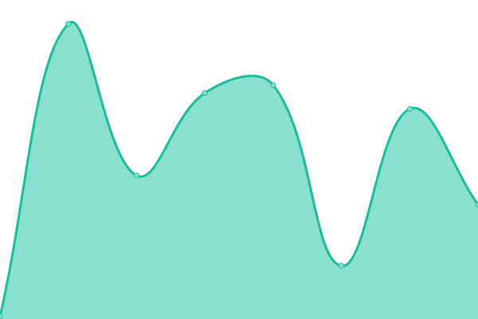
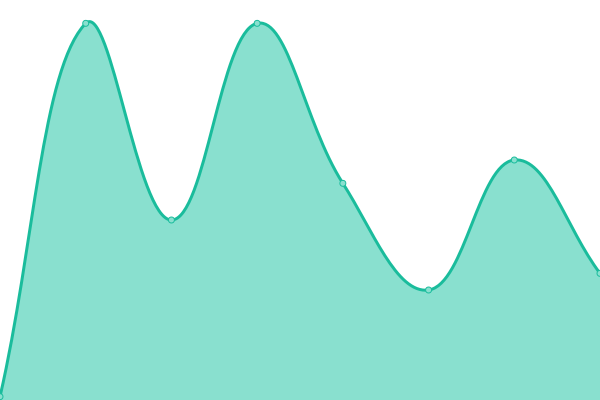
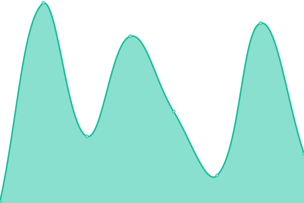
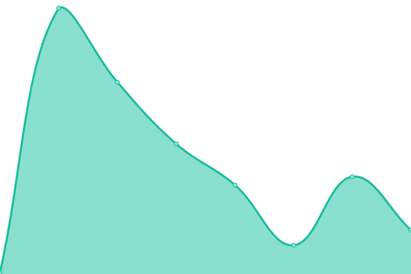
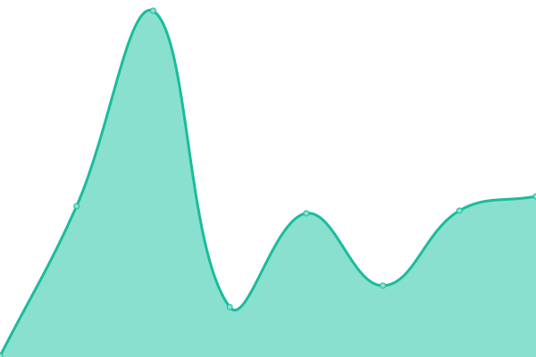
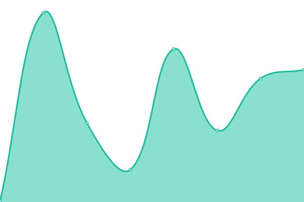

# [📈 Live Status](https://keshav-writes-code.github.io/upptime): <!--live status--> **🟩 All systems operational**

This repository contains the open-source uptime monitor and status page for [Keshav](https://keshav.is-a.dev/), powered by [Upptime](https://github.com/upptime/upptime).

With [Upptime](https://upptime.js.org), you can get your own unlimited and free uptime monitor and status page, powered entirely by a GitHub repository. We use [Issues](https://github.com/keshav-writes-code/upptime/issues) as incident reports, [Actions](https://github.com/keshav-writes-code/upptime/actions) as uptime monitors, and [Pages](https://keshav-writes-code.github.io/upptime) for the status page.

<!--start: status pages-->
<!-- This summary is generated by Upptime (https://github.com/upptime/upptime) -->
<!-- Do not edit this manually, your changes will be overwritten -->
<!-- prettier-ignore -->
| URL | Status | History | Response Time | Uptime |
| --- | ------ | ------- | ------------- | ------ |
|  [Portfolio](https://keshav.is-a.dev/) | 🟩 Up | [portfolio.yml](https://github.com/Keshav-writes-code/upptime/commits/HEAD/history/portfolio.yml) | 

 239ms
     
 | 

<a href="https://keshav-writes-code.github.io/upptime/history/portfolio">100.00%</a>
    

|  [FreqKnow](https://keshav.is-a.dev/FreqKnow/) | 🟩 Up | [freq-know.yml](https://github.com/Keshav-writes-code/upptime/commits/HEAD/history/freq-know.yml) | 

 57ms
     
 | 

<a href="https://keshav-writes-code.github.io/upptime/history/freq-know">100.00%</a>
    

|  [Learning Trade](https://keshav.is-a.dev/learning_trade/) | 🟩 Up | [learning-trade.yml](https://github.com/Keshav-writes-code/upptime/commits/HEAD/history/learning-trade.yml) | 

 50ms
     
 | 

<a href="https://keshav-writes-code.github.io/upptime/history/learning-trade">100.00%</a>
    

|  [NeuralNetBuilder](https://keshav.is-a.dev/NeuralNetBuilder/) | 🟩 Up | [neural-net-builder.yml](https://github.com/Keshav-writes-code/upptime/commits/HEAD/history/neural-net-builder.yml) | 

 57ms
     
 | 

<a href="https://keshav-writes-code.github.io/upptime/history/neural-net-builder">100.00%</a>
    

|  [Digit Recognizer](https://keshav.is-a.dev/digit_recognizer/) | 🟩 Up | [digit-recognizer.yml](https://github.com/Keshav-writes-code/upptime/commits/HEAD/history/digit-recognizer.yml) | 

 68ms
     
 | 

<a href="https://keshav-writes-code.github.io/upptime/history/digit-recognizer">100.00%</a>
    

|  [GDM Links](https://gdm-links.vercel.app/) | 🟩 Up | [gdm-links.yml](https://github.com/Keshav-writes-code/upptime/commits/HEAD/history/gdm-links.yml) | 

 109ms
     
 | 

<a href="https://keshav-writes-code.github.io/upptime/history/gdm-links">100.00%</a>
    

|  [SMS Sewa Counter](https://sms-count.vercel.app/) | 🟩 Up | [sms-sewa-counter.yml](https://github.com/Keshav-writes-code/upptime/commits/HEAD/history/sms-sewa-counter.yml) | 

 93ms
     
 | 

<a href="https://keshav-writes-code.github.io/upptime/history/sms-sewa-counter">100.00%</a>
    

<!--end: status pages-->

[**Visit our status website →**](https://keshav-writes-code.github.io/upptime)

## 📄 License

- Powered by: [Upptime](https://github.com/upptime/upptime)
- Code: [MIT](./LICENSE) © [Anand Chowdhary](https://anandchowdhary.com), supported by [Pabio](https://pabio.com)
- Data in the `./history` directory: [Open Database License](https://opendatacommons.org/licenses/odbl/1-0/)
